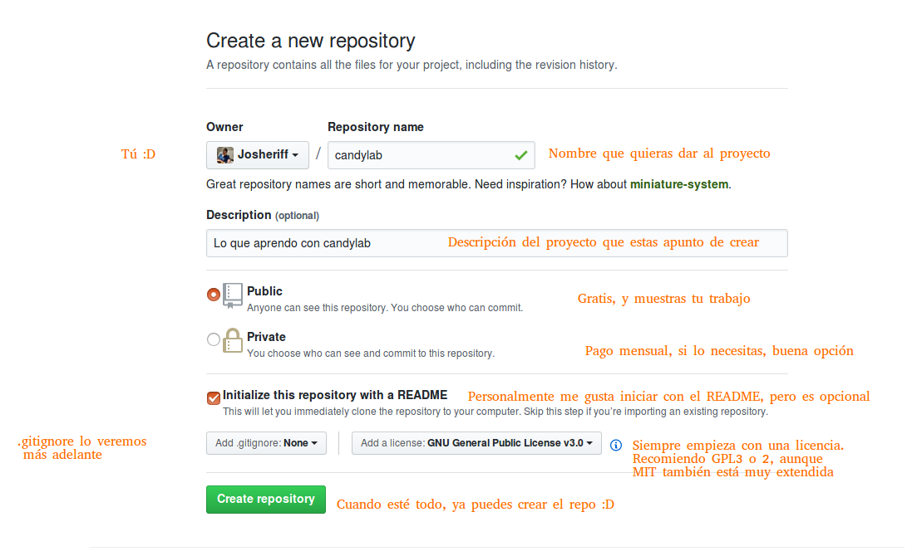

## Crear un portfolio

Un portfolio es donde un desarrollador muestra su trabajo.

Suele ser usualmente una página web, y nosotros lo vamos a utilizar para aprender lo más básico del lenguaje.

De esta forma pretendo matar dos pájaros de un tiro, aprender mientras se realiza algo que te va a ser de gran ayuda.

No es que sea algo estrictamente necesario, pero tener un portfolio actualizado y atractivo, es la versión del desarrollador
de tener un curriculum actualizado y bonito. Si bien es cierto que existe Linkedin y que algunas empresas viven ancladas en el pasado
y siguen pidiendo curriculum vitae.

Un portfolio con pantallazos de tus desarrollos y enlaces al github de los mismos, queda muy profesional.

## Github Pages

Como ya te he comentado, un portfolio es una página web, que viene siendo un curriculum interactivo.

Afortunadamente Github permite el uso del llamado "github pages", lo que significa que puedes alojar en github tantos proyectos frontend como quieras
y que estos sean una página web, de tal forma que si accedes al repositorio a través del dominio "tunombre.github.io/nombreDelProyecto" el navegador usará ese código ya que
no es ni mas ni menos que otra pagina web, sólo que está directamente alojada en github... Cómodo ¿Verdad?

Si accedes al código por el dominio "github.com/tunick/turepo" seguirás viendo el código como hasta ahora.

Por lo tanto, alojando nuestro portfolio en github pages sólo tenemos que subir el código a github y acceder mediante "tunombre.github.io/nombreDelProyecto", sin tener que
comprar dominios, ni servidores ni alojamiento ni nada, sólo hacer push y listo.

## Procedimiento

Aunque ya he explicado como crear un repositorio repetiré el procedimiento a continuación aunque de una forma un poco más rápida.

- Entramos en github.com estando logueados, o nos logueamos, y pulsamos sobre el botón 
- A continuación tendremos algo parecido al siguiente pantallazo PERO hemos de llamar al repositorio, "portfolio":

- Ahora vamos a configurar este repositorio para que nos sirva como un servidor para nuestra web estática, pinchando en "settings", lo encontrarás rodeado en naranja en la siguiente imagen.

- A continuación tendrémos que bajar mucho, y justo antes de encontrarnos en la zona de peligro (donde se puede borrar el repositorio), encontraremos el apartado "Github Pages" donde tendrémos que elegir en un desplegable que pone "None" la opción "master branch"

Hemos elegido "master branch" porque es la rama principal si hubieramos elegido "master branch /docs folder" tendríamos que meter la página dentro de una carpeta llamada DOCS.

Esto último es útil cuando estás desarrollando un producto y quieres dejar documentación para los futuros posibles usuarios del mismo.

Para nosotros la opción "master" será la mas cómoda, pues sólo tendremos que hacer push de nuestro código y este quedará automáticamente publicado.

A partir de ahora si visitas "https://tunick.github.io/portfolio" podrás visitar tú pagina de portfolio, que por ahora está vacía.

Pongamos algo para que no quede tan vacío...

[TEMA ANTERIOR](./basichtml.md) || [SIGUIENTE TEMA](./primeraslineas.md)
