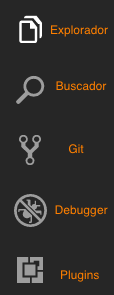

## Editor o IDE

Para escribir código lo único que hace falta es un editor de texto, en realidad cualquiera puede valer
pero los editores especializados en código nos hacen la vida mas fácil, colorea los diferentes elementos
del código lo que hace más fácil identificarlos a simple vista, autocierran los simbolos de los difrentes 
lenguajes...

Estos editores pueden además ser ampliados con plugins para poder personalizarlos aún mas.

Un IDE hace lo mismo, pero además te facilita herramientas para realizar las tareas más típicas del desarrollo.

En general un editor con unos cuantos plugins es un entorno de trabajo óptimo, aunque hay gente que prefiere
los IDE.

Los editores mas conocidos son: Visual Studio Code, Atom, Sublime Text, Vim, Emacs...

IDEs conocídos: Webstorm, Komodo, Visual Studio...

En este poryecto recomiendo Visual Studio Code.

## Visual Studio Code

Este editor desarrollado por Microsoft es uno de los más usados en la actualidad por numerosas razones.

Aunque Microsoft ha tenido un pasado truculento con el Open Source, últimament intenta lavar su cara
ofreciendo herramientas open source para desarrolladores, independientemente de todo esto, es un editor fácil
con muchas configuraciones por defecto que es de gran ayuda para alguien que está empezando.

Puedes descargar Visual Studio Code [aquí](https://code.visualstudio.com/download)

### Descripción y uso

- Para abrir una carpeta nos vamos archivo, abrir, y seleccionamos la carpeta con la que queremos trabajar
- Si te fijas en la parte izquierda tienes una barra con los siguientes iconos:

   

- Para ver los archivos que tenemos dentro de la carpeta usamos el explorador
- La busqueda vale para buscar texto en todo el proyecto o en el archivo abierto, también vale para sustituir una palabra.
- Las herramientas de git, las veremos en profundidad un poco mas adelante
- El debugger no vamos a usarlo en principio, aunque si al final aprendo a usarlo igual hasta es útil y todo :P
- Los plugins, sirven para expandir la funcionalidad del editor.

A continuación dejo un pequeño video de como abrir una carpeta con VScode.

<video controls autoplay width="100%">
  <source src="./img/editor/vscodeOpen.mp4" type="video/mp4">
</video>

### Plugins

