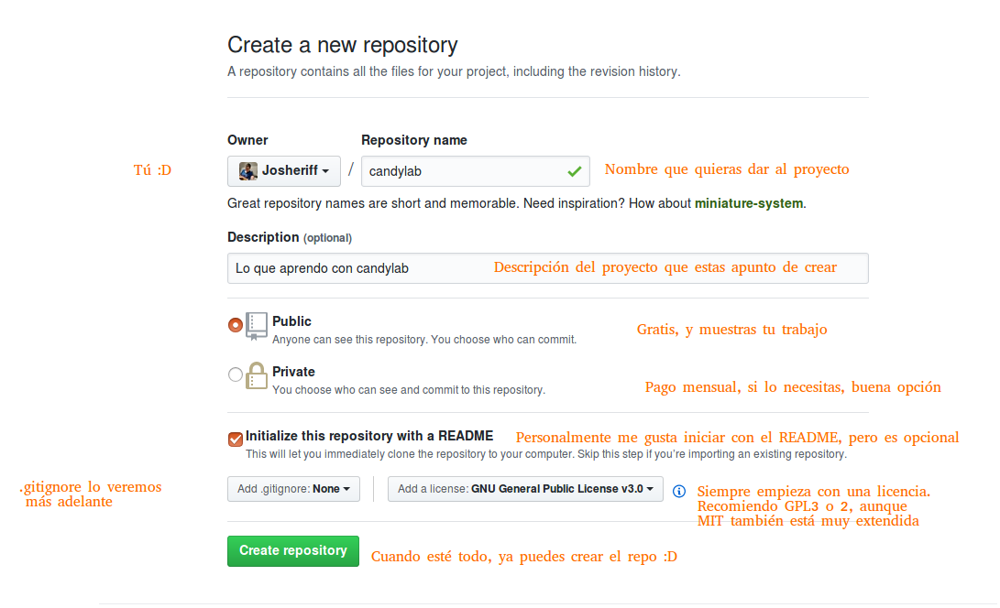
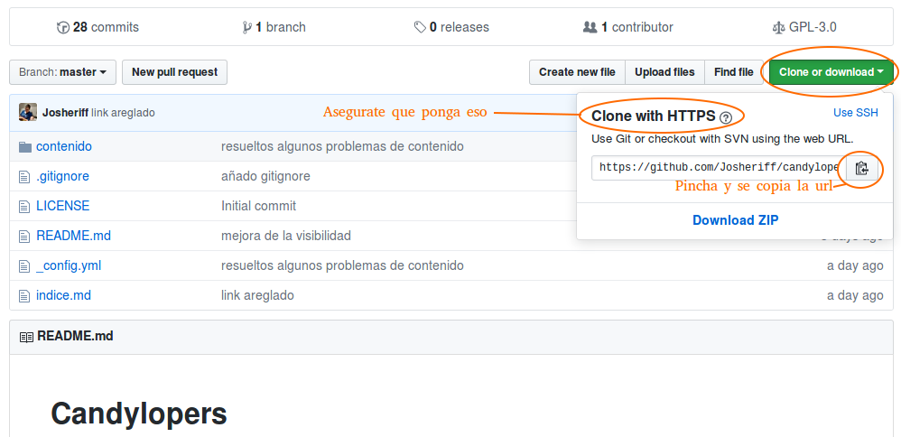

# Git y Github

## Git 

Es una herramienta de control de versiones, para poder tener varias versiones del mismo archivo sin necesidad de ir cambiandole el nombre por cada versión.

Además facilita la colaboración con mas desarrolladores.

Las versiones se guardan en el servidor.

Al igual que cuando haces copias de seguridad de las fotos en la nube, las fotos en principio están en el movil y en la nube.

La sincronización no es automática y tendrás el control de que archivos quieres sincronizar, cuales no y cuando.

## Instalación git

- Si usas Windows ve a este [enlace](https://gitforwindows.org/), descarga y ya sabes, siguiente, siguiente aceptar.

Tras acabar la instalación tendrás un [terminal](./glosario.md#terminal) con el logotipo de git y windows fusionados en el escritorio, pinchalo y ejecuta los siguientes comandos, sustituyendo por tu username y tu email
```
git config --global user.name "Tu nombre"
git config --global user.email "tuemail@candyloper.es"

```
Cada vez que sincronices con github lo harás con ese nombre y ese email.

- Si usas Mac OS-X es posible que lo tengas ya instalado sin que lo sepas, de todas formas puedes instalarlo usando Homebrew y asegurarte.

```
brew install git
```

Si no tienes homebrew hay un instalador para git [aquí](https://sourceforge.net/projects/git-osx-installer/files/git-2.16.3-intel-universal-mavericks.dmg/download)

la configuración posterior igual que en windows, abre un terminal (CMD+SPACE "terminal"):

```
git config --global user.name "Tu nombre"
git config --global user.email "tuemail@candyloper.es"

```

- Si usas Linux:
    - Debian / Ubuntu:
      ```
      sudo apt-get update
      sudo apt-get install git
      ```
    - Fedora:
      ```
      sudo dnf install git
      O
      sudo yum install git
      ```
    Misma configuración desde el terminal que anteriormente

## Github

Github es una plataforma basada en git, donde los desarrolladores pueden subir su código y utilizar las ventajas de git.

Puesto que git facilita la colaboración con otros desarrolladores, github también tiene una parte social, en la que puedes colaborar en otros proyectos u otros pueden participar en el tuyo.

Si en una red social habitual se suben fotos, en github se sube y comparte código.

Tener un github activo ayuda a la hora de encontrar trabajo, pues los cazadores de talentos tienen la impresión que una persona que colabora muy activamente en la comunidad de desarrolladores es mejor programador.
Es un tema que ha generado bastante debate, pues, parece bastante obvio que lo único que demuestra es que esa persona tiene mas tiempo libre que otra.
No obstante siendo el objetivo encontrar trabajo, jugaremos las reglas del juego actuales, y ya cuando podamos lucharemos para cambiarlas para próximas generaciones.

## Creación de cuenta en github

Dirigete a la página principal de [Github](https://github.com/) donde se te solicitará username, email y password.

El proceso es bastante sencillo.

Una vez tienes una cuenta, vuelves a ingresar en [Github](https://github.com/login) 

## Creación de un repositorio

Ahora vamos a crear un repositorio donde vamos a ir dejando todo lo que aprendas en este proyecto.

Una vez logueado tienes que estar en [Github](https://github.com/), a la derecha verás un botón verde que pone "new repository" 
te llevará a un menú como el que te muestro a continuación comentado por mí en letras anaranjadas:




## Clonación en tu ordenador para futuras sincronizaciones

Una vez que has finalizado de crear tu proyecto, tenemos que llevarlo también a una carpeta de tu ordenador que será con la que iras sincronizando cuando lo creas apropiado.

Atento porque es lo último que necesitamos hacer desde el repositorio de github (aunque se puede hacer también desde consola, esto es más fácil).



Una vez copiado siguiendo las instrucciones de la imagen, vamos a descargarlo a tu entorno.

Vamos a crear una carpeta en tu ordenador que alojará todos tus proyectos.

Abre el terminal si estas en Linux o Mac y el terminal especial de git si estas en Windows (todas las instrucciones para Windows, partirán de la base que estás en ese terminal a partir de ahora)

Cuando lo abres te situa en tu "home", vamos a crear la carpeta "github.com" y siempre descargaremos nuestros repositorios ahí.

Una vez abierto el terminal escribe:

ATENCIÓN, NO DEBES COPIAR Y PEGAR COMANDOS DIRECTAMENTE A LA CONSOLA, NUNCA.
ESCRIBE ESTOS COMANDOS A MANO, POR TU SEGURIDAD, Y POR NO PERDER EL ENLACE QUE ACABAS DE COPIAR :P
```
mkdir github.com
```

Ya tenemos el directorio creado, ahora vamos a entrar dentro de ese directorio.

```
cd github.com
```

Ya estamos dentro de nuestro direcotorio github, ahora tenemos que clonar el repositorio. Si me has hecho caso y has escrito los comandos tu mismo, seguiras teniendo la url copiada. escribe pues "git clone" seguida de la url que copiaste, ejemplo:

```
git clone https://github.com/TuNombreUser/candylab.git
```

Ahora se nos ha creado un directorio llamado candylab, entrando en el como hicimos antes con el comando `cd nombreDirectorio`, estaremos en la raiz de nuestro repositorio candylab.

es decir estaremos en `/home/Tuusario/github.com/candylab/` y ese es el directorio donde tenemos que estar para trabajar con nuestro proyecto y así extrapolandolo al resto de proyectos.

## Sincronización y comandos

Cuando entres en tu directorio, podrás ver el contenido usando el comando `ls` , también puedes ver en el contenido desde tu navegador de archivos gráfico que uses (Finder, Archivos, Nautilus...)

Vamos a practicar los comandos desde el terminal o consola.

Abre el terminal y dirigete al directorio donde está tu proyecto. utilizando `ls` y `cd` , para subir un nivel `cd ..` por si te equivocas...

Una vez dentro de la carpeta que anteriormente habíamos clonado procedo a explicarte los comandos más basicos de git.

`git status` -> Te dice si estas por delante o por detrás en cuanto a version de archivos, te dice también si te falta algún archivo que "sincronizar"

`git pull` -> Te actualiza a la versión mas moderna que haya en la nube, muy recomendable hacerlo antes de empezar a hacer cambios en cualquier archivo.

`git add nombreDeArchivo.txt nombreDirectorio` -> "Marca" el archivo o todo el directorio que le digas para ser actualizado, es decir, si cambias algo en un archivo tienes que hacer `git add` ese archivo para que cuando termines este se suba a la nube y reemplace la versión mas antigual del mismo.

Se puee hacer `git add .` vease el punto... para añadir todo, aunque no está considerado una buena practica, porque a veces se te cuelan archivos que en realidad tu no querías subir.

`git commit -m "Un mensaje"` dice el motivo del cambio dentro del mensaje, escribirá un mensaje para todo lo que hayas hecho add. por ejemplo: "Corregidos varios typos"

Por último:

`git push`, si has hecho pull, add, commit, ahora solo te queda hacer `push` que subirá los archivos a la nube, probablemente te pida usuario y contraseña, puedes usar el email o el nick que eligieras en github, y la contraseña siempre es la misma.


## Ejercicio

Cambia el README.md y añade una pequeña descripción de lo que te gustaría aprender, un par de lineas es suficiente.

Despues sincronizalo con tu repositorio en la nube.

Para confirmar que se ha sincronizado adecuadamente, no tienes mas que visitar:

``` 
https://github.com/tuNombreUsuario/nombreDeRepositorio
```

