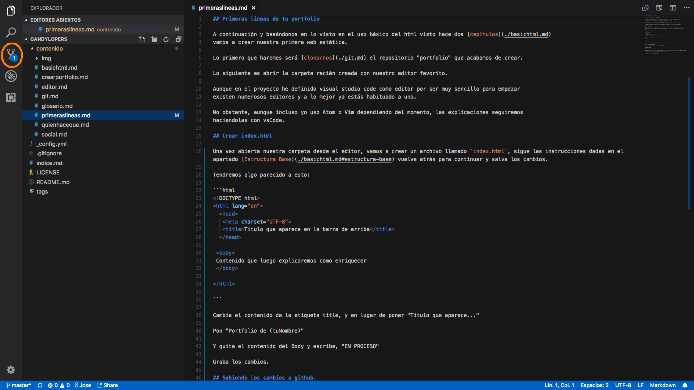
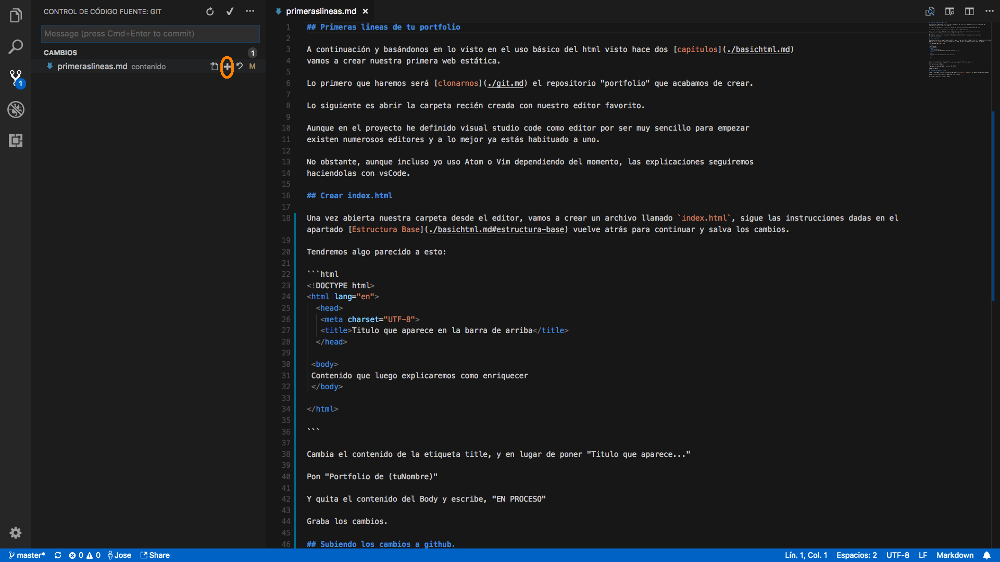
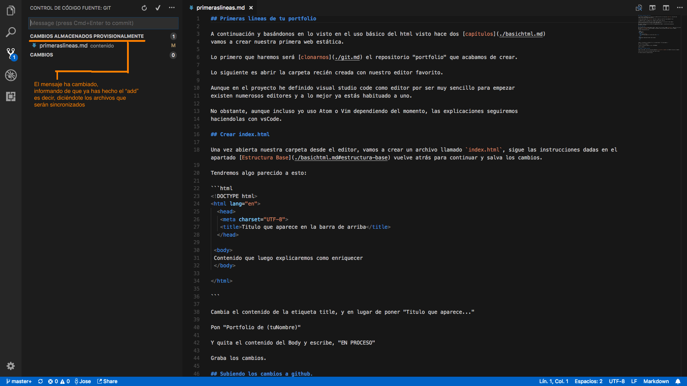
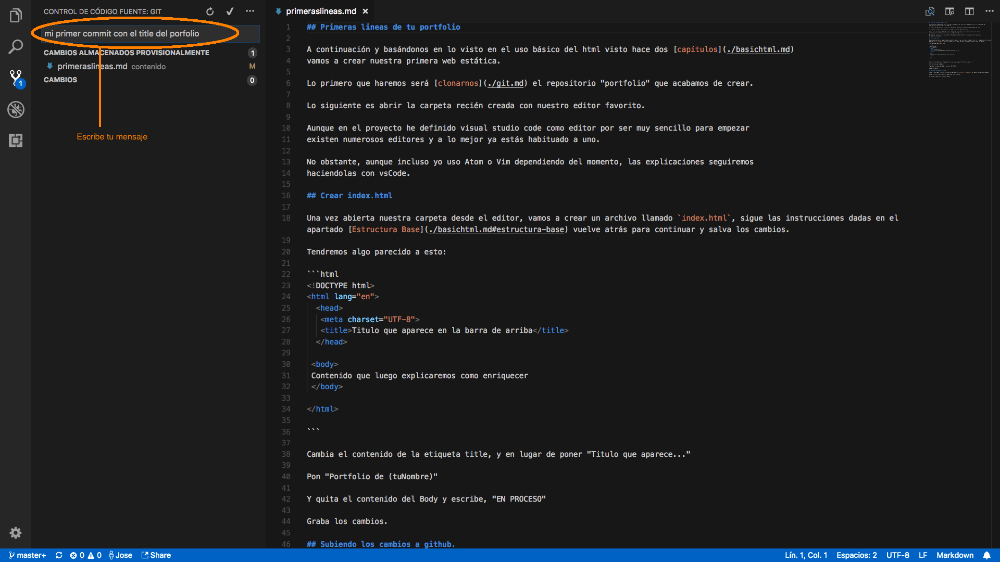
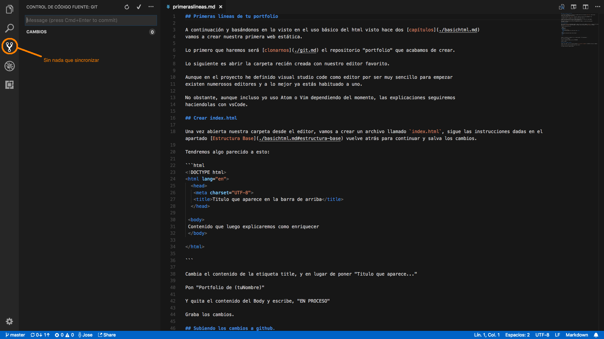

## Primeras lineas de tu portfolio

A continuación y basándonos en lo visto en el uso básico del html visto hace dos [capítulos](./basichtml.md)
vamos a crear nuestra primera web estática.

Lo primero que haremos será [clonarnos](./git.md) el repositorio "portfolio" que acabamos de crear.

Lo siguiente es abrir la carpeta recién creada con nuestro editor favorito.

Aunque en el proyecto he definido visual studio code como editor por ser muy sencillo para empezar
existen numerosos editores y a lo mejor ya estás habituado a uno.

No obstante, aunque incluso yo uso Atom o Vim dependiendo del momento, las explicaciones seguiremos
haciendolas con vsCode.

## Crear index.html

Una vez abierta nuestra carpeta desde el editor, vamos a crear un archivo llamado `index.html`, sigue las instrucciones dadas en el apartado [Estructura Base](./basichtml.md#estructura-base) vuelve atrás para continuar y salva los cambios.

Tendremos algo parecido a esto:

```html
<!DOCTYPE html>
<html lang="en">
  <head>
   <meta charset="UTF-8">
   <title>Titulo que aparece en la barra de arriba</title>
  </head>

 <body>
 Contenido que luego explicaremos como enriquecer
 </body>

</html>

```

Cambia el contenido de la etiqueta title, y en lugar de poner "Titulo que aparece..."

Pon "Portfolio de (tuNombre)"

Y quita el contenido del Body y escribe, "EN PROCESO"

Graba los cambios.

## Subiendo los cambios a github.

Puedes o bien seguir las instrucciones del apartado [sincronización y comandos](./git.md#sincronizacion-y-comandos)

O bien utilizar la caracteristica de git que tiene el editor.

En VsCode se hará como muestra la secuencia de imágenes a continuación marcado en naranja:







## Comprobar

Si ahora vas a https://github.com/tunick/Portfolio

Comprobarás que hay un arhivo nuevo llamado index.html que acabas de crear.

si te dirijes a:

https://tunick.github.io/portfolio

Verás el html renderizado, es decir en la parte de arriba del navegador, en la barra de arriba del todo pondrá:

"Mi portfolio"

## Poniendo un título al documento

Todo lo que se escriba dentro de la etiqueta `body` será lo que aparezca en la página.

Dentro de `body` vamos a crear un encabezado, un titulo grande que de contexto al portfolio.

Así pues dentro de la equiqueta `body` vamos a escribir `<h1>Mi Portfolio</h1>`

Quedando el conjunto de todo, así:

```html
<!DOCTYPE html>
<html lang="en">
  <head>
   <meta charset="UTF-8">
   <title>Titulo que aparece en la barra de arriba</title>
  </head>

 <body>
   <h1>Mi Portfolio</h1>
 </body>

</html>

```


[TEMA ANTERIOR](./crearportfolio.md) || [SIGUIENTE TEMA](./rellenando.md)